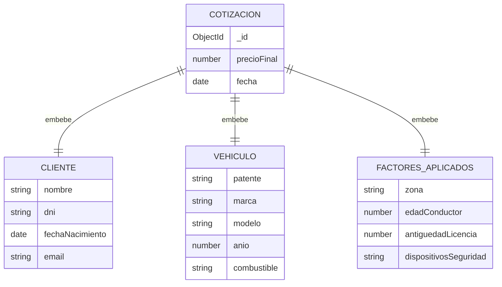

# Documentación del Sistema — Cotizador de Seguros Automotores

**Grupo 104** — Federico Quinteros, Lorenzo Pattini, Uriel Palma

---

## 1. Diseño y documentación de Base de Datos

### Motor y justificación
Se utiliza **MongoDB Atlas** (NoSQL, orientado a documentos) en lugar de una base relacional por:
- Esquema flexible: las cotizaciones pueden tener atributos variables sin necesidad de migraciones.
- Embedding de datos relacionados (cliente, vehículo, factores) en un solo documento, evitando joins.
- Alineación natural con JSON, el formato que ya maneja el backend en sus respuestas REST.
- Escalabilidad horizontal para el crecimiento futuro del proyecto.

### Base y colección
- **Base de datos:** `cotizador-tfi`
- **Colección principal:** `cotizaciones`

### Decisión de diseño: embedding vs. referencias
Se optó por embeber los datos del cliente, el vehículo y los factores aplicados dentro de cada documento de cotización, en lugar de crear colecciones separadas y referenciarlas. Motivo: una cotización es un registro histórico que no debe cambiar aunque el cliente actualice sus datos más adelante — necesitamos una "foto" congelada de la información tal como era en el momento de cotizar, no una referencia viva.

### Esquema

```json
{
  "_id": "ObjectId",
  "cliente": {
    "nombre": "string",
    "dni": "string",
    "fechaNacimiento": "date",
    "email": "string"
  },
  "vehiculo": {
    "patente": "string",
    "marca": "string",
    "modelo": "string",
    "anio": "number",
    "combustible": "string"
  },
  "factoresAplicados": {
    "zona": "string",
    "edadConductor": "number",
    "antiguedadLicencia": "number",
    "dispositivosSeguridad": ["string"]
  },
  "precioFinal": "number",
  "fecha": "date"
}
```

### Diagrama de la colección



### Evidencia
La base `cotizador-tfi` y la colección `cotizaciones` ya fueron creadas en el cluster de MongoDB Atlas del equipo, con un documento de ejemplo cargado que valida la estructura definida arriba.

---

## 2. Definición funcional de cada módulo

### Módulo 1 — Consulta de datos del vehículo
- **Descripción:** obtiene marca, modelo, año y combustible del vehículo a partir de una API externa de autos.
- **Entrada:** selección del usuario (marca/modelo/año) desde los datos que ofrece la API.
- **Salida:** objeto `vehiculo` completo para usar en el módulo de cálculo.
- **Nota:** la patente se ingresa como dato informativo aparte, sin validarse contra ninguna API (no se cuenta con una de consulta por patente).

### Módulo 2 — Gestión de usuarios/prospectos
- **Descripción:** registra los datos del titular y conductor, y mantiene el historial de cotizaciones por cliente.
- **Entrada:** datos personales ingresados por el usuario (nombre, DNI, fecha de nacimiento, email).
- **Salida:** documento `cliente` embebido en cada cotización asociada.

### Módulo 3 — Motor de cálculo de cotización
- **Descripción:** aplica las reglas de negocio (factor regional, personal y del vehículo) sobre un valor base para generar el precio final.
- **Entrada:** datos del cliente, del vehículo y de la zona.
- **Salida:** documento `cotizacion` completo, persistido en la colección `cotizaciones`.

### Módulo 4 — Dashboard de estadísticas
- **Descripción:** presenta el embudo de conversión (cotización → compra) y un mapa de calor geográfico por zona.
- **Entrada:** lectura agregada sobre la colección `cotizaciones`.
- **Salida:** visualizaciones para el equipo comercial.

---

## 3. Requerimientos funcionales y no funcionales

### Funcionales
- El sistema debe permitir seleccionar marca, modelo, año y combustible del vehículo desde una API externa.
- El sistema debe permitir registrar los datos del cliente y del conductor.
- El sistema debe calcular el precio final de la póliza aplicando las reglas de negocio vigentes.
- El sistema debe generar cotizaciones para varias aseguradoras de forma simultánea.
- El sistema debe conservar el historial de cotizaciones por cliente.
- El sistema debe mostrar estadísticas de conversión y demanda por zona.

### No funcionales
*(a definir en equipo)*
- Tiempo de respuesta esperado del cálculo de cotización.
- Disponibilidad del servicio.
- Seguridad y confidencialidad de los datos personales almacenados.
- Escalabilidad ante el crecimiento del volumen de cotizaciones.

---

## 4. Reglas de negocio

La prima final se calcula aplicando reglas secuenciales sobre un valor base:
- **Factor Regional:** multiplicador según zona/código postal (zonas de mayor o menor riesgo).
- **Factor Personal:** recargo para conductores menores de 25 años; ajuste según antigüedad de la licencia de conducir.
- **Factor del Vehículo:** ajuste según tipo de combustible (nafta/diésel/eléctrico); descuentos por dispositivos de seguridad (alarma, GPS, cortacorriente).

*(Los valores numéricos exactos de cada factor —porcentajes y rangos— se definen en equipo.)*

---

## 5. Diagramas

- **Diagrama de flujo general del sistema:** ver `docs/TP_Final_Diagrama_de_Flujo.jpg`.
- **Diagrama de la colección de MongoDB:** incluido en la sección 1 de este documento.
- *(Diagrama de componentes/clases del backend: a definir en equipo.)*
